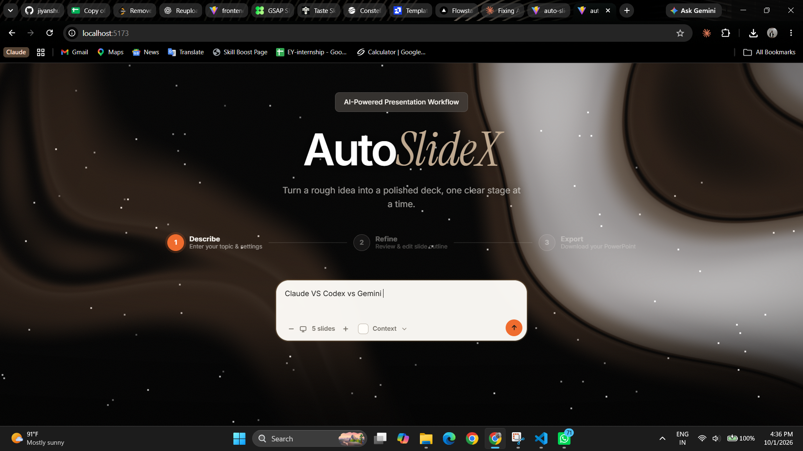
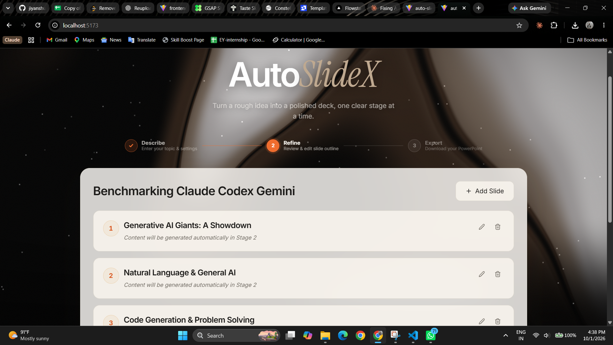
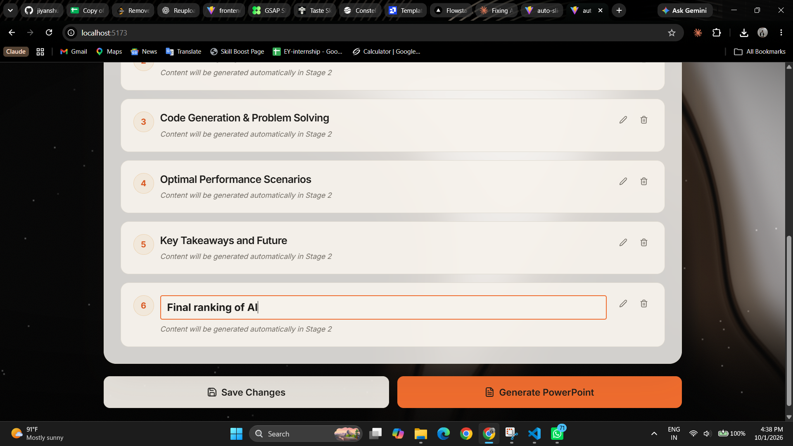
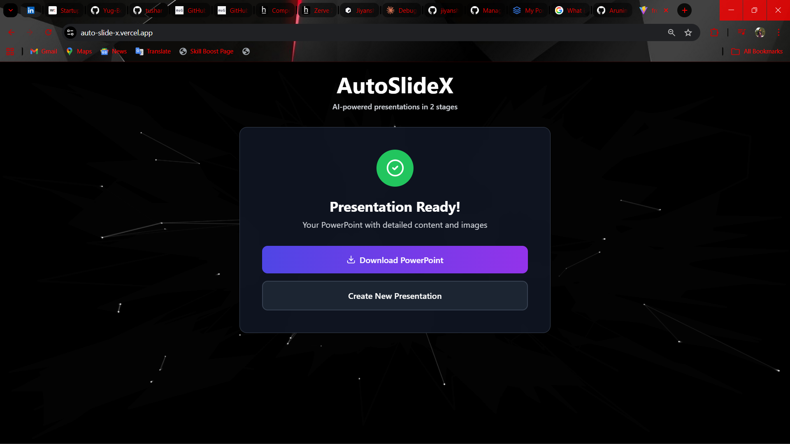
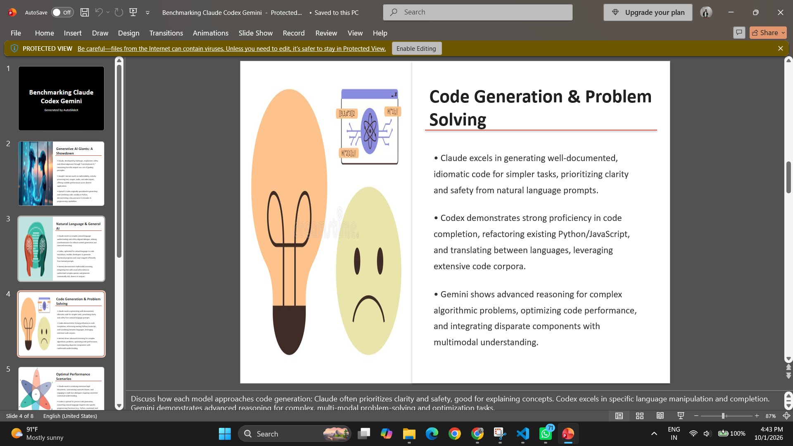

# AutoSlideX 🎯

**Intelligent PowerPoint Presentation Generator powered by AI**

AutoSlideX is a full-stack application that leverages Google's Gemini AI to automatically generate professional PowerPoint presentations from simple topics or descriptions. It combines a modern React frontend with a powerful FastAPI backend to create an seamless presentation generation experience.

---

## 🌟 Features

- ✨ **AI-Powered Content Generation**: Automatically generate comprehensive slide content using Google Gemini AI
- 🎨 **Professional Templates**: Multiple design templates for presentations
- 📊 **Interactive UI**: Modern, responsive interface with animated effects
- 💾 **Download Capability**: Export presentations as PowerPoint files
- 🔄 **Real-time Editing**: Customize slides before export
- 🚀 **Fast Performance**: Optimized backend with model fallback mechanisms
- 🌐 **Full-Stack**: Complete solution with frontend and backend

---

## 📁 Project Structure

```
AutoSlideX/
├── frontend/                # React + Vite frontend application
│   ├── src/
│   │   ├── components/
│   │   │   └── presentation_genrator.jsx
│   │   ├── App.jsx
│   │   ├── main.jsx
│   │   └── assets/
│   ├── package.json
│   ├── vite.config.js
│   ├── tailwind.config.js
│   └── README.md
├── backend/                 # FastAPI backend service
│   ├── main.py
│   ├── pptx_generator.py
│   ├── requirements.txt
│   ├── render.yaml
│   └── README.md
├── images/                  # Project screenshots and assets
│   ├── Home.png
│   ├── Download.png
│   ├── Final-ppt.png
│   ├── New-slide.png
│   └── Preveiw.png
└── README.md               # This file
```

---

## 🎬 Application Screenshots

### Home Page
The main interface where users enter presentation topics and specify the number of slides needed.


*AutoSlideX Home Interface - Enter topic and slide count to generate presentation*

---

### Presentation Preview
Preview your slides before downloading them.


*Slide Preview - Review your presentation before export*

---

### Create New Slide
Add and customize individual slides to your presentation.


*New Slide Creation - Add custom content to presentations*

---

### Download Presentation
Export your generated presentation as a PowerPoint file with a single click.


*Download Feature - Save your presentation in PPTX format*

---

### Final PowerPoint Presentation
The completed presentation exported and ready for use.


*Generated PowerPoint Presentation - Professional quality output*

---

## 🚀 Quick Start

### Prerequisites

- **Node.js** (v16 or higher) - for frontend
- **Python** (3.10 or higher) - for backend
- **npm** or **yarn** - for frontend package management
- **Google Gemini API Key** - for AI content generation

### Frontend Setup

```bash
cd frontend

# Install dependencies
npm install

# Start development server
npm run dev

# Build for production
npm run build
```

The frontend will be available at `http://localhost:5173`

### Backend Setup

```bash
cd backend

# Create virtual environment
python -m venv venv
source venv/bin/activate  # On Windows: venv\Scripts\activate

# Install dependencies
pip install -r requirements.txt

# Create .env file with your credentials
echo "GEMINI_API_KEY=your_api_key_here" > .env

# Start development server
uvicorn main:app --reload

# Or start with specific host and port
uvicorn main:app --host 0.0.0.0 --port 8000
```

The backend API will be available at `http://localhost:8000`

**API Documentation**:
- Swagger UI: `http://localhost:8000/docs`
- ReDoc: `http://localhost:8000/redoc`

---

## 🛠️ Technology Stack

### Frontend
- **React** 19.1 - UI library
- **Vite** 7.1 - Build tool and dev server
- **Tailwind CSS** 3.4 - Utility-first styling
- **Lucide React** 0.544 - Icon library
- **ESLint** 9.36 - Code quality

### Backend
- **FastAPI** 0.115 - Web framework
- **Uvicorn** 0.32 - ASGI server
- **Google Generative AI** - Gemini AI integration
- **python-pptx** 1.0.2 - PowerPoint generation
- **Pydantic** 2.9 - Data validation
- **Pillow** 11.0 - Image processing

---

## 📚 API Endpoints

### Generate Presentation Content
```
POST /api/generate
```
Generate AI-powered slide content for a given topic.

**Request**:
```json
{
  "topic": "Introduction to Machine Learning",
  "num_slides": 5,
  "additional_context": "Focus on practical applications"
}
```

### Update Presentation
```
PUT /api/update
```
Modify existing presentation slides.

### Generate PowerPoint
```
POST /api/generate_ppt
```
Export the presentation as a PowerPoint file.

**Request**:
```json
{
  "presentation_id": "uuid-string",
  "template": "modern",
  "export_format": "pptx"
}
```

### Get Presentation Status
```
GET /api/presentations/{presentation_id}
```
Retrieve presentation details and status.

---

## 🎨 Available Templates

- **Modern** - Contemporary design with blue and orange accents
- **Professional** - Corporate-style presentation theme

Each template includes:
- Pre-defined color schemes
- Professional fonts
- Optimized layouts for different slide types

---

## 📦 Dependencies Overview

### Frontend Dependencies
| Package | Version | Purpose |
|---------|---------|---------|
| react | ^19.1.1 | UI library |
| react-dom | ^19.1.1 | DOM rendering |
| lucide-react | ^0.544.0 | Icons |
| tailwindcss | ^3.4.18 | Styling |
| vite | ^7.1.7 | Build tool |

### Backend Dependencies
| Package | Version | Purpose |
|---------|---------|---------|
| fastapi | 0.115.0 | Web framework |
| uvicorn | 0.32.0 | ASGI server |
| google-generativeai | 0.8.3 | Gemini AI |
| python-pptx | 1.0.2 | PowerPoint generation |
| pydantic | 2.9.0 | Data validation |
| requests | 2.32.3 | HTTP client |

---

## 🔐 Environment Variables

Create a `.env` file in the backend directory:

```env
# Required
GEMINI_API_KEY=your_google_gemini_api_key

# Optional (for image search features)
GOOGLE_API_KEY=your_google_custom_search_api_key
GOOGLE_SEARCH_ENGINE_ID=your_custom_search_engine_id
```

---

## 🌐 Deployment

### Frontend Deployment (Vercel, Netlify, etc.)
```bash
cd frontend
npm run build
# Deploy the dist/ folder
```

### Backend Deployment (Render, Heroku, etc.)
The project includes `render.yaml` for easy deployment on Render:

```bash
git push origin main
# Render will automatically deploy
```

**Render Configuration**:
- Service Type: Web Service
- Runtime: Python 3.10
- Build Command: `pip install -r requirements.txt`
- Start Command: `uvicorn main:app --host 0.0.0.0 --port 10000`

---

## 🔄 How It Works

1. **User Input**: User enters presentation topic and desired number of slides
2. **AI Generation**: FastAPI backend sends request to Google Gemini AI
3. **Content Processing**: Gemini generates intelligent slide content
4. **Presentation Build**: python-pptx creates PowerPoint file with generated content
5. **Download**: User downloads the completed presentation
6. **Editing**: Optional - users can edit slides before downloading

---

## 📖 Documentation

For detailed information, refer to:

- **[Frontend Documentation](frontend/README.md)** - React setup, components, and scripts
- **[Backend Documentation](backend/README.md)** - FastAPI endpoints, models, and configuration

---

## 🐛 Troubleshooting

### Common Issues

**1. GEMINI_API_KEY not found**
- Solution: Ensure `.env` file exists in backend directory with valid API key

**2. CORS errors when accessing backend**
- Solution: Backend is configured with CORS for all origins. Check API URL in frontend config

**3. Module not found errors**
- Solution: Run `npm install` (frontend) or `pip install -r requirements.txt` (backend)

**4. Port already in use**
- Solution: Change port number in startup command
  ```bash
  # Frontend: Check vite.config.js
  # Backend: uvicorn main:app --port 8001
  ```

**5. Python version mismatch**
- Solution: Ensure Python 3.10+ is installed
  ```bash
  python --version
  ```

---

## 🤝 Contributing

Contributions are welcome! To contribute:

1. Fork the repository
2. Create a feature branch (`git checkout -b feature/AmazingFeature`)
3. Commit changes (`git commit -m 'Add AmazingFeature'`)
4. Push to branch (`git push origin feature/AmazingFeature`)
5. Open a Pull Request

### Code Guidelines
- Follow PEP 8 for Python
- Use ESLint for JavaScript/React
- Write clear commit messages
- Add documentation for new features

---

## 🚀 Future Enhancements

### Planned Features
- [ ] User authentication and accounts
- [ ] Saved presentation history
- [ ] Templates library with custom designs
- [ ] Collaborative editing
- [ ] Export to PDF, ODP formats
- [ ] Image library integration
- [ ] Presentation themes customization
- [ ] Dark mode support
- [ ] Multi-language support
- [ ] Real-time collaboration

---

## 📊 Performance Metrics

- **Slide Generation**: ~2-5 seconds per presentation
- **PowerPoint Export**: <1 second
- **API Response Time**: Average 1-3 seconds
- **File Upload/Download**: Optimized for files up to 50MB

---

## 🔐 Security Considerations

- ✅ CORS configured with wildcard (can be restricted in production)
- ✅ Input validation with Pydantic
- ✅ Environment variables for sensitive data
- ✅ No user data stored (stateless API)
- ⚠️ Consider adding rate limiting for production
- ⚠️ Implement authentication for production deployment

---

## 📞 Support & Contact

For issues, feature requests, or questions:
- Check existing documentation in `/frontend/README.md` and `/backend/README.md`
- Review API documentation at `/docs` endpoint
- Check troubleshooting section above

---

## 📄 License

This project is part of the AutoSlideX initiative.

---

## 🎯 Getting Help

### For Frontend Issues
- See [Frontend README](frontend/README.md)
- Check Vite documentation: https://vite.dev
- React docs: https://react.dev

### For Backend Issues
- See [Backend README](backend/README.md)
- FastAPI docs: https://fastapi.tiangolo.com
- Gemini AI docs: https://ai.google.dev

---

## 📈 Project Status

- ✅ Frontend: Complete
- ✅ Backend: Complete
- ✅ Core Features: Implemented
- 🔄 Enhancements: In Progress

---

**Made with ❤️ for presentations**
